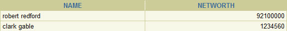
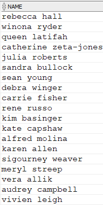
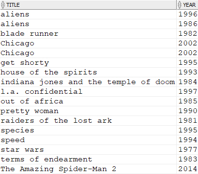
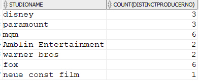
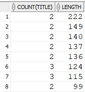

- [`**Movie DB**` ](http://cs.ks.ac.kr/db/movie_db.html)에 대해서 아래의 query를 `**SQL**` 문장으로 작성하고 결과를 나타내시오.
- **제출 기한 : 6월 3일(월) 당일 자정**
- 각 질의는 하나의 SQL 문장으로만 작성하고 번호.sql로 문제당 하나의 파일에 저장한다.
- 메일 제목은 **SQL HW#2**로 첨부파일명은 **학번.zip**으로 하고 반드시 메일당 하나의 과제물만 포함한다.
- 아래 지문에서 제작자는 영화를 제작한 적이 있는 자이며 영화배우는 MovieStar 테이블의 모든 사람에 해당한다. 영화에 출연한 적이 있는 배우이면 StarsIn 테이블과 JOIN이 되어야 한다.

1. 각 영화사 별 평균 상영시간, 처음으로 제작한 영화의 상영년도, 제작 영화 수 등을 제작 영화 수의 역순으로 검색하여라.

2. 3편 이상(>= 3)의 영화에 출연한 배우들 중에서 영화사 사장인 배우의 이름과 재산을 찾아라.[[수행결과\]

3. 가장 수입이 많은 제작자(영화를 제작한 적이 있는 영화임원들중에서)와 가장 수입이 적은 영화사 사장(영화사 사장인 영화임원들중에서)이 함께 만든 영화들의 제목과 상영년도는 ? **[검색결과]** **(mighty ducks, 1991)**

4. 영화사 사장이면서 배우이기도 한 제작자는 ? **[검색결과 : alfred molina, robert redford]**

5. 영화 Sting에 출연하지 않은 여자 배우들의 이름을 어린 배우 순으로 검색하여라

6. *Danny DeVito* 보다 젊은 여자 배우가 출연한 각 영화들중에서 가장 긴 상영시간을 가지는 영화의 제목과 상영년도를 영화 제목 순으로 검색하여라. **(각 여자배우가 출연한 영화들 중에서 긴 상영시간을 가지는 영화를 각각 구해야 한다)** 

7. 같은 주소에 사는 배우들이 출연한 영화들의 평균 상영시간과 가장 최근에 출연한 영화의 상영년도는 ?

   [수행 결과]

   | 주소                 | 평균상영시간 | 상영년도 |
   | -------------------- | ------------ | -------- |
   | cleveland, ohio      | 157          | 1983     |
   | massapequa, new york | 122          | 1997     |

    **(같은 주소에 사는 배우들이 출연한 모든 영화에 대해서 구해야 한다. 따라서, 주소 단위의 결과를 필요로 한다. 또한, 같은 영화에 두 배우가 함께 출연하는 경우 각각 서로 다른 영화로 취급한다)**

8. 가장 나이가 많은 배우가 출연한 영화들중에서 가장 상영 시간이 긴 영화는 ? **[검색결과] gone with the wind**

9. 각 영화사의 영화들을 만든 제작자들의 평균 수입이 1,000,000 이상인 영화사 이름과 제작자들의 수는 ? **(Fox 영화사에서 George Lucas라는 제작자가 여러 영화의 제작에 참여하는 경우 George Lucas의 netWorth 값은 평균에서 한번만 고려되어야 하고, 따라서 Fox 영화사의 제작자 수는 George Lucas를 하나로 counting을 해야 한다)**

   [수행결과]

   

10. 영화 배우이면서 제작자인 사람들의 평균 수입은 ? **(영화 배우는 실제로 영화에 출연한 적이 있어야 하며, 제작자 역시 실제로 영화 제작에 참여한 적이 있어야 한다)** **[검색결과] 23810000**

11. 상영 시간이 같은 영화들의 수와 각 상영 시간을 상영 시간의 역순으로 검색하여라. 

    [수행결과]

12. *Harrison Ford*가 출연한 영화의 수와 평균 상영 시간은 ? **[검색결과] (5, 120.2)**